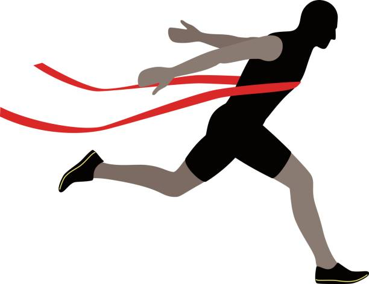

## Java on Steroids

Having done in Java for the past two semesters, the transition to another language, namely JavaScript, has been a lot smoother than expected as opposed to learning it without any programming experience. Knowing basic programming essentials such as declaring variables, forming loops, creating arrays, creating functions, etc. has proven useful when transitioning to another language. In fact, it seems as if JavaScript is Java on steroids; in Java, you had to specify the type of each variable and the return type of a function while in JavaScript, you use let, const, var to declare variables and you do not specify the return type when making functions. For now, I see JavaScript as more convient compared to Java because the latter seems more strict about variables and syntax.

### Access Levels

In Java, you can specify the access level of your code: public, protected, private. Each can affect how your classes interact with each other; for instance, when a function is modified as private, only the class containing such function is able to call it. In JavaScript, however, you do not use such modifiers. For instance when making a function:

```javascript
function myFunction {
  //my code
}
```


As for the workout of the day (WODs), they seem to push the students to find solutions in faster and more efficient ways. The timed practice WODs are essential tools not only to practice for class assessments but also to improve our critical thinking and problem-solving skills. It almost feels like I am on the P90X workout program, and it will probably be a tough and gruelling schedule that could potentially yield great results, depending on my concentration and determination to improve. Overall, the teaching style is meant to get students out of the comfort zone, and I do agree that this is a fundamental aspect of deliberate practice. Nevertheless, it is definitely intersting to see my results as I challenge myself through these WODs. 



