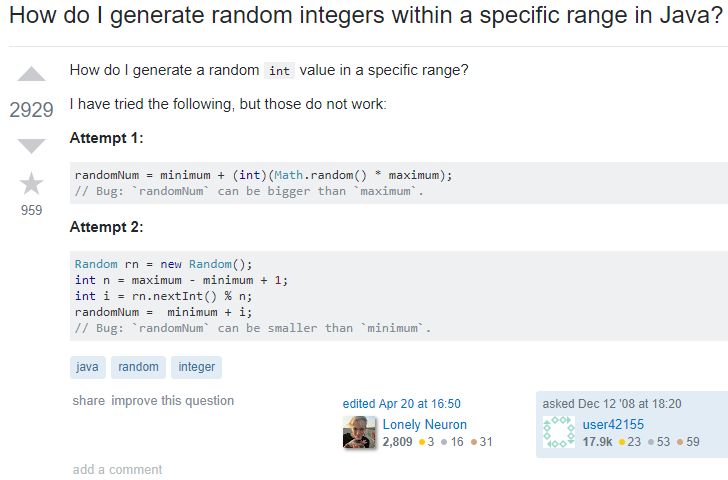
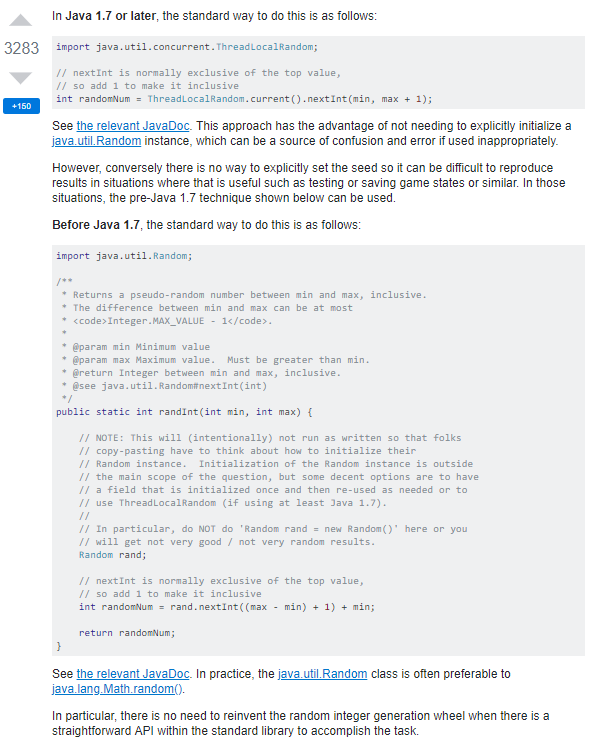
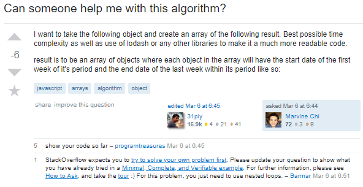
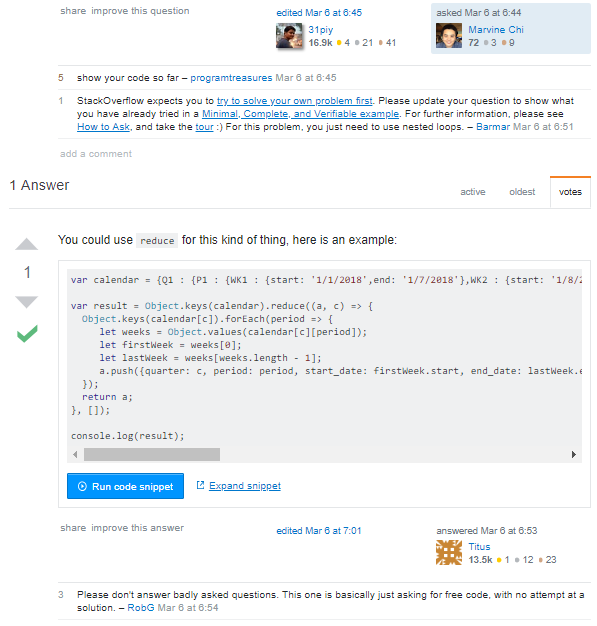

## A powerful tool for mankind

When attempting to understand new concepts that seem too complex to grasp or trying to master a certain skill but cannot seem to progress, it never hurts to ask for assistance—one beautiful aspect of the human language that has enabled humankind to prosper and improve our quality of life. **That is our ability to ask questions**. Each question has the potential to inspire new ideas and unlock breakthroughs that otherwise could not have been discovered; it could stimulate people's imagination and creativity, and it encourages others to learn about the subject matter. However, despite the benefits it offers, a question could also demotivate others, depending on its delivery and depth. For instance, a computer scientist will inevitably get stuck on certain problems, multiple times in his career. Sometimes, it is necessary to ask others some meaningful questions.

## How do you ask questions?

Eric S. Raymond, one of the authors of "How to Ask Questions The Smart Way", provides several key points on how to ask smart and meaningful questions. He descriptively laid out how "hackers" love solving challenging problems and that it keeps their minds constantly engaged and stimulated. That is not to say they are always available around, answering every question they find, continuously catering to people's ignorance. They have lives too, they have their own problems to deal with and throwing lackadaisical questions at them will not help them at all. In Raymond's essay, there are select key points that stand out the most among his ample set of rules: 

- At least attempt to solve what you are asking first (or know something about it)
- Be precise and informative about your problem
- Use meaningful, specific subject headers

### At least have some knowledge regarding your question

According to Raymond,

> When you ask your question, display \[...\] that you're not being a lazy sponge and wasting people's time.

My personal interpretation on this key point is that you should not ask about something when you have not researched or read about it. It often helps to try to understand the concepts that relate to the question beforehand because there will be a chance that the answer will be as incomprehensible as the problem being inquired about. This can also apply to writing codes. Those who ask must attempt to solve the problem until they are completely out of options (and they should show their attmpts too). [An example of a good question would be this](https://stackoverflow.com/questions/363681/how-do-i-generate-random-integers-within-a-specific-range-in-java#):

  

This question would then be granted with a very detailed answer.

  

Not everyone is expected to find solutions by themselves, and people out there are willing to help if the person who asked the question showed effort in solving the problem first. I believe that cooperation and teamwork allow for better learning experience and it is never wrong to rely on others for help. Although, if that person tries to obtain answers the *easy way*, it will only display laziness and arrogance, and most people will have minimal tolerance for lackluster effort.

### What do you include in the question?

On the other hand, people should include more details when forming questions. This way, others who (kindly enough) give attention to such questions are not left guessing the actual problem. Not only does it waste time for those people who try to answer, but it also aggravates them. The person asking should at least add his code, or type a paragraph explaining his progress and struggles. This way, it would be easier to diagnose the problem and formulate possible solutions. [Here's an example]():

*The original unedited post did not include the person's code so I had to exclude it.*

  

Because of the post's lack of information and precision, it got downvoted and not surprisingly, it pissed off some people.

  

## Do your research first

Last but not the least, refrain from asking 
