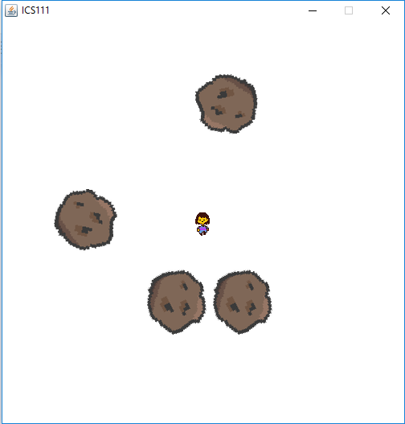

In this project, we were given the opportunity to choose our own group or partner. We were to create any type of program based on how much we have learned throughout the whole semester. After countless deliberations, my partner and I agreed to create a game based on the popular mobile app Flappy Bird, but this time the character could move freely and there are more obstacles to dodge (in this case, the asteroids). Again, with the help of EZ Graphics, we were able to use pre-implemented functions that would create the movements of the objectj (the main character and the asteroids).

This project is the first time I collaborated with someone, albeit I fully knew that someone since we went to the same school. Nevertheless, I learned the importance of teamwork, and to systematically divide tasks between each other. Of course, there were frustrations during the process, but this project made me realize that I will someday collaborate with many people with varying personalities and quirks. This time, though, I am lucky enough to be partnered with someone I knew. This is also an important project for me because we were not given any guidelines, and it was up to us to determine the result of our project using our knowledge that we accumulated during the whole semester. This shows that everytime we learn something, we need to permanently instill them in our minds, and not just treat them as something to be memorized, but rather deeply understood.

Source: <a href="https://github.com/gbfrancisco/AsteroidDodge"><i class="large github icon"></i>AsteroidDodge</a>
