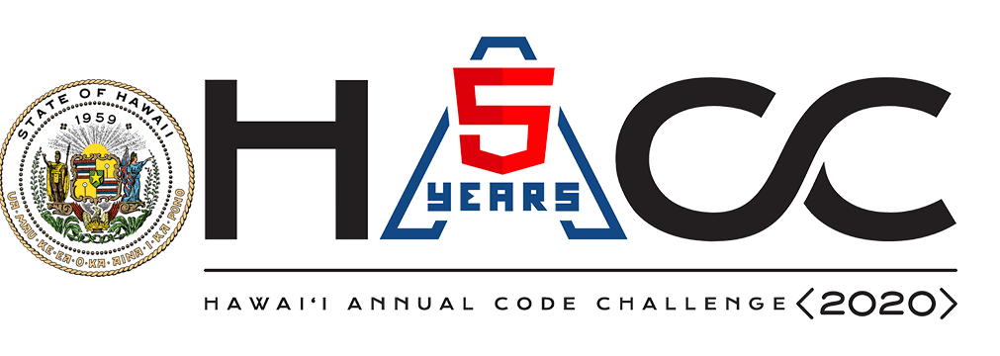
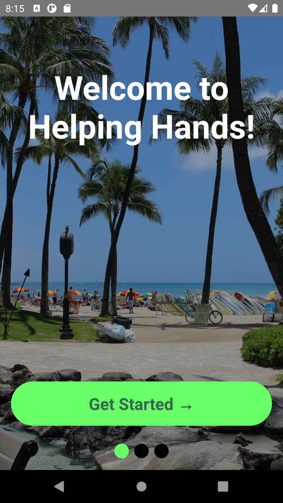
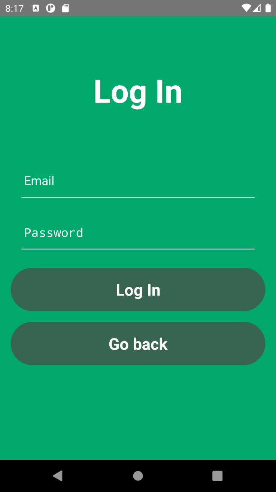
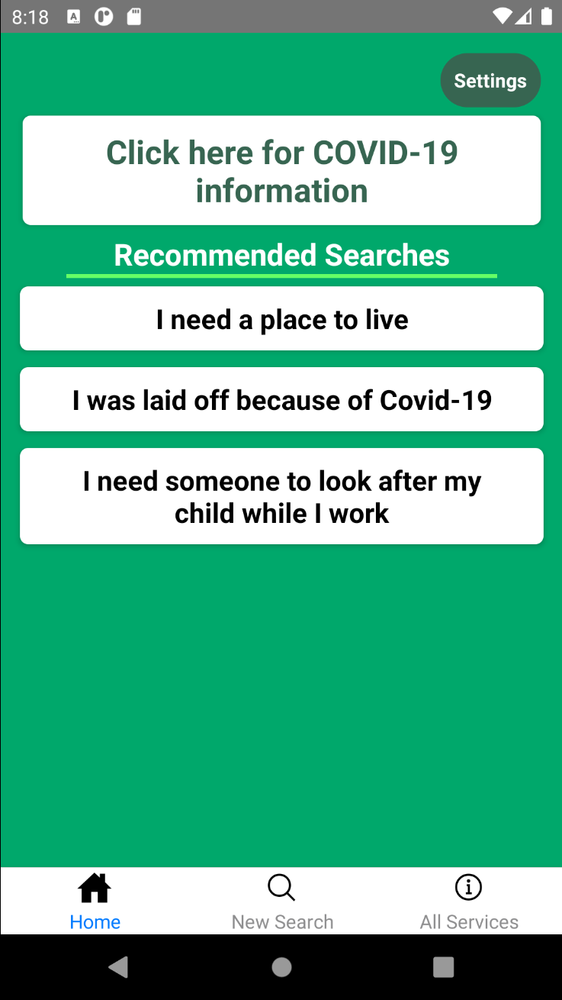
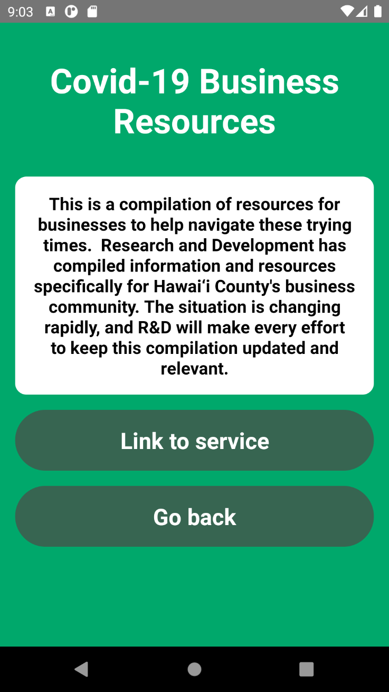
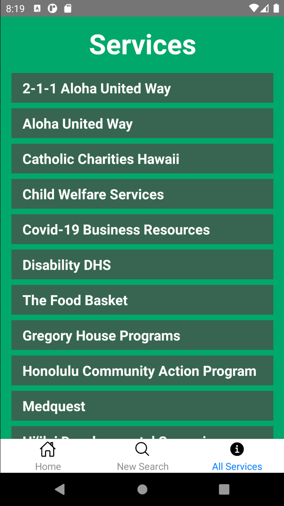
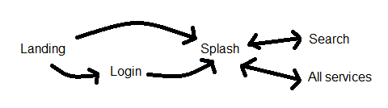

## Hawaii Annual Code Challenge (HACC)

 <i>Where innovation starts</i> 

The Hawaii Annual Code Challenge (or HACC) is an event taking place every fall where the participants can showcase their creativity and technical abilities to develop applications to help solve various problems presented by the local community and state agencies. The participants must form teams and are given a couple or more weeks to design a product which they will have an opportunity to present should they get selected by the technical judges. HACC always had been an in-person event, but due to the COVID pandemic, it was held virtually via Zoom.

## And So It Begins

#### The Team

Our team, called HACCsgiving, comrpised of 4 students currently enrolled in ICS 491: **[Me](https://github.com/gbfrancisco), [Calvan Liang](https://github.com/calvan-liang), [Micah Kim](https://github.com/kimmicah), [Kegan Flagg](https://github.com/LukewarmCoffee)** and a UH ICS graduate **[Christopher Na](https://github.com/chrisjna)**. Only Chris has done HACC in the past, and his experience has proven to be crucial in letting the team know beforehand what's in store in this hackathon. 

#### The Challenge

The event presented many challenges such as gamification of crowdsource indexing, COVID-19 chatbot, campus occupancy trends visualization and many more. The challenge which our team agreed to tackle was the **[Connections: Hawai‘i State Resource Directory](https://hacc.hawaii.gov/wp-content/uploads/2020/10/Challenge_2020_ResourceDirectory.pdf)** for the First Lady Dawn Amano-Ige. This challenge aims to provide an electronic repository of services, programs, resources as well as benefits for those in need. It should serve as a one-stop-shop directory of services which users can easily get referred to and gain access.

We selected the Hawai‘i State Resource Directory because we thought a mobile application would be the most fitting for a problem like this. After all, the challenge did require user-friendliness, so making it a mobile app will definitely be easier to use and more accessible to people compared to using laptops or desktops to open a web app.

## A Hand That Helps (User Guide)

<i>Click on the image to see higher resolution.</i>

#### Landing Screen

When you first run the app, this is the creen that appears first.

#### Question Screen

The screen that appears after clicking the "Get Started" button from the landing screen. If "No", then the user will be redirected straight to the Splash Screen. If "Yes" otherwise, then the user will be redirected to the Login Screen.

#### Login Screen

This is a standard login screen for state employees.

#### Splash Screen

This is the main page of the application. It has a tab navigation which can redirect the user to other screens such as the Search and All Services screen.

#### Search Screen

The search screen allows the user to search for services based on words related to such services.

#### Service Card

Clicking on a service will show a card containing the service's description and allows the user to redirect to the service's website. 

#### All Services Screen

This screen essentially shows all services (that are also clickable) available in the app.

#### <a href="../images/holdinghands/videos/demo.mp4"> Video Demo (by Kegan) </a>

## Work, work, work

#### Techs used

For this application, the team decided to use **[React-Native](https://reactnative.dev/docs/tutorial)** as the mobile application framework and firebase as the back-end service.
We thought of using React-Native because most of us already knew JavaScript, and have used React.js in our past ICS classes. We figured it would be best to stick with what we are familiar with instead of rushing ourselves to learn development kits like Flutter and languages like Dart. On the other hand, we stuck with Firebase because it is one of the more popular mobile app development back-end services. It provided us Firebase Auth for the authentication and Firebase Firestore for the database.

#### Workflow

Initially, the planning did not go smoothly; no one had a clear direction or idea on how the app was supposed to go. The development finally jump started when one of our members, Kegan, devised a mockup plan that includes the following app workflow: 

 <i>App Workflow from Mockup</i> 

## Aftermath

The quick brown fox...

## Links
**[Helping Hands Devpost](https://devpost.com/software/helping-hands-o96srp)** 
**[HACCsgiving GitHub](https://github.com/HACC2020/HACCsgiving)**
