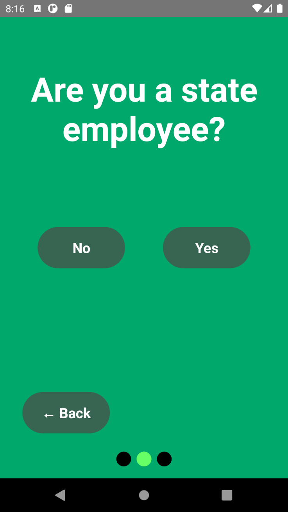
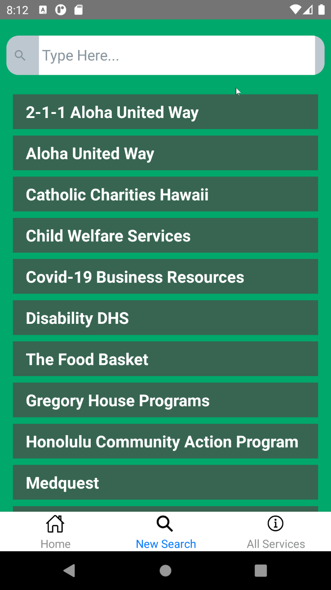

## Hawaii Annual Code Challenge (HACC)

 <i>Where innovation starts</i> 

The Hawaii Annual Code Challenge (or HACC) is an event taking place every fall where the participants can showcase their creativity and technical abilities to develop applications to help solve various problems presented by the local community and state agencies. The participants must form teams and are given a couple or more weeks to design a product which they will have an opportunity to present should they get selected by the technical judges. HACC always had been an in-person event, but due to the COVID pandemic, it was held virtually via Zoom.

## And So It Begins

#### The Team

Our team, called HACCsgiving, comrpised of 4 students currently enrolled in ICS 491: **[Me](https://github.com/gbfrancisco), [Calvan Liang](https://github.com/calvan-liang), [Micah Kim](https://github.com/kimmicah), [Kegan Flagg](https://github.com/LukewarmCoffee)** and a UH ICS graduate **[Christopher Na](https://github.com/chrisjna)**. Only Chris has done HACC in the past, and his experience has proven to be crucial in letting the team know beforehand what's in store in this hackathon. 

#### The Challenge

The event presented many challenges such as gamification of crowdsource indexing, COVID-19 chatbot, campus occupancy trends visualization and many more. The challenge which our team agreed to tackle was the **[Connections: Hawai‘i State Resource Directory](https://hacc.hawaii.gov/wp-content/uploads/2020/10/Challenge_2020_ResourceDirectory.pdf)** for the First Lady Dawn Amano-Ige. This challenge aims to provide an electronic repository of services, programs, resources as well as benefits for those in need. It should serve as a one-stop-shop directory of services which users can easily get referred to and gain access.

We selected the Hawai‘i State Resource Directory because we thought a mobile application would be the most fitting for a problem like this. After all, the challenge did require user-friendliness, so making it a mobile app will definitely be easier to use and more accessible to people compared to using laptops or desktops to open a web app.

## A Hand That Helps (User Guide)

<i>Click on the image to see higher resolution.</i>

#### Landing Screen

When you first run the app, this is the creen that appears first.

#### Question Screen

The screen that appears after clicking the "Get Started" button from the landing screen. If "No", then the user will be redirected straight to the Splash Screen. If "Yes" otherwise, then the user will be redirected to the Login Screen.

#### Login Screen

This is a standard login screen for state employees.

#### Splash Screen

This is the main page of the application. It has a tab navigation which can redirect the user to other screens such as the Search and All Services screen.

#### Search Screen

The search screen allows the user to search for services based on words related to such services.

#### Service Card

Clicking on a service will show a card containing the service's description and allows the user to redirect to the service's website. 

#### All Services Screen

This screen essentially shows all services (that are also clickable) available in the app.

#### <a href="../images/holdinghands/videos/demo.mp4"> Video Demo (by Kegan) </a>

## Work, work, work

#### Techs used

For this application, the team decided to use **[React-Native](https://reactnative.dev/docs/tutorial)** as the mobile application framework and firebase as the back-end service.
We thought of using React-Native because most of us already knew JavaScript, and have used React.js in our past ICS classes. We figured it would be best to stick with what we are familiar with instead of rushing ourselves to learn development kits like Flutter and languages like Dart. On the other hand, we stuck with Firebase because it is one of the more popular mobile app development back-end services. It provided us Firebase Auth for the authentication and Firebase Firestore for the database.

#### Workflow

Initially, the planning did not go smoothly; no one had a clear direction or idea on how the app was supposed to go. The development finally jump started when one of our members, Kegan, devised a mockup plan that includes the following app workflow:

 <i>App Workflow from Mockup</i> 

After that, the team started to work on it without utilizing some of the well known software engineering methodologies such as Agile, Waterfall, or Scrum. We decided to just keep adding features to the application as much as we could while staying faithful as much as possible to the mockup workflow.

Each member had to choose their own role to either work on the front-end or back-end. As such, Calvan, Micah, and I decided to do the front-end while Kegan and Chris handled the back-end.

## Aftermath

Overall, the HACC event was an interesting experience, provided that it was my first time competing in the event. Definitely, there have been some ups and downs, but there are no regrets in taking up this challenge, because I learned some lessons along the way.

#### More Love for Front-End

Having done back-end work in my previous project for ICS 491, it was refreshing to focus more heavily on the UI of Helping Hands. Not only did I do so to adhere to the "user-friendly" requirement of the challenge, but it also meant as a way to let all my creative juices flow. One might say the back-end is the meat of an app, but I'd disagree. Both front-end and back-end should be held equally as important. It's arguable, but I firmly believe that if you take out the front-end, no one is going to care about the app. Of course, people care about the functionality which is provided by the back-end, but if the app is too complex, or poorly designed, consumers will most likely to switch to another app.

#### Reaction to React-Native

That said, I believe React-Native is a love and hate relationship when it comes to front-end. Sure, the native components are slick and look great in mobile (in my opinion). Also I love messing around with `flex` in a mobile platform compared to mindlessly performing trial-and-error with css in web app. All of these are good, but it's usually the case that you have to go beyond these components. Thus, you will inevitably have to rely on third party libraries such as React Navigation, React Native Elements, React Native Paper, or those you find on the `npmjs` site. This is risky at times because you need to make sure they are up to date, and they must also be compatible with the other libraries that you have installed. 

#### Plan to plan

As mentioned earlier, planning was not done properly for our team. I believe coming up with ideas is one of the biggest hurdles you have to get past in order to jump-start development. Thus, I would say we could have done better in terms of planning. One way to do it is by brainstorming in a **voice call**. I find it ineffective to communicate ideas just through text, and hearing your teammates' voices seems to have more impact and agency. Unfortunately, as we all had vastly different and conflicting schedules, it was hard to find the perfect time where everyone could be present. Also, we were not able to utilize methodologies we have learned in ICS 414 Software Engineering II like Agile. Had we done this in a more organized fashion, then perhaps we could have incorporated more features.

#### What’s in Store for the Future

This has been my first time developing a mobile application, and quite frankly, I enjoyed it. Perhaps in the future, I will shift the application from React-Native to Flutter. Most people who have developed mobile apps that I have talked to kept gushing about Flutter, and I am interested in learning about it more. Apparently, most of the articles I have read online predict that Flutter will overtake React-Native in the near future. Therefore, it's not a bad idea to acquire another skillset in case Flutter does indeed becomes the next big thing.

Another potential addition would be machine learning. I have never done it, ever. Although, it does seem interesting to add to my skills. After joining the Google breakout room during the HACC event, I learned about how Firebase has a service that provides machine learning to your app. I have not personally checked the cost for it, but I would be willing to be that the investment will be worth it should I continue to pursue this path.

All in all, attending HACC and enrolling in ICS 491 allowed me to dip my toes in the world of Software Engineering. The struggles we have faced such as dealing with deadlines, pulling our hairs out due to bugs we cannot seem to fix in an instant, the amount of time spent trying to setup the dev environment instead of actually coding, the requirements given by the clients being vague or misunderstood by the developers—all of these are bound to happen in a real job. Having to experience these allows me to be aware and be more prepared in the future.

## Links
**[Helping Hands Devpost](https://devpost.com/software/helping-hands-o96srp)** 
**[HACCsgiving GitHub](https://github.com/HACC2020/HACCsgiving)**

####
