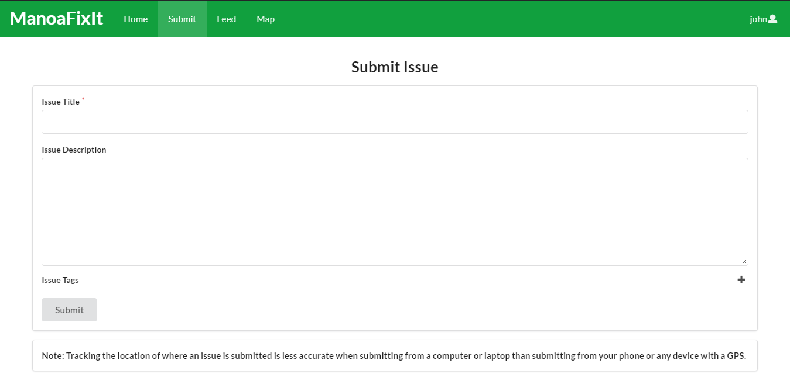
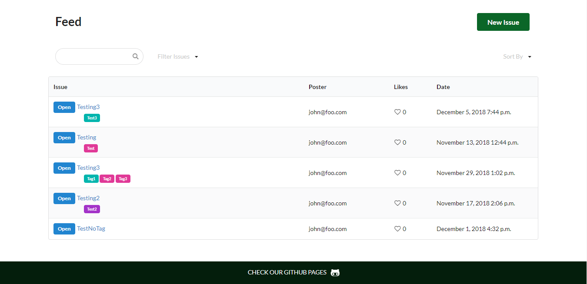
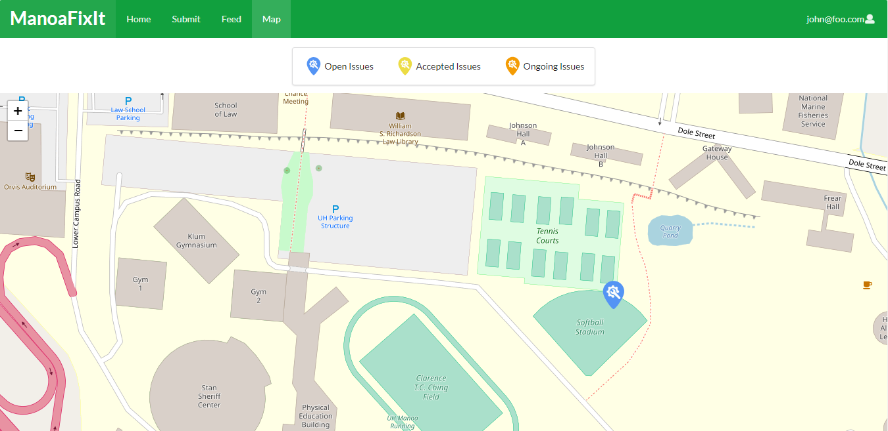
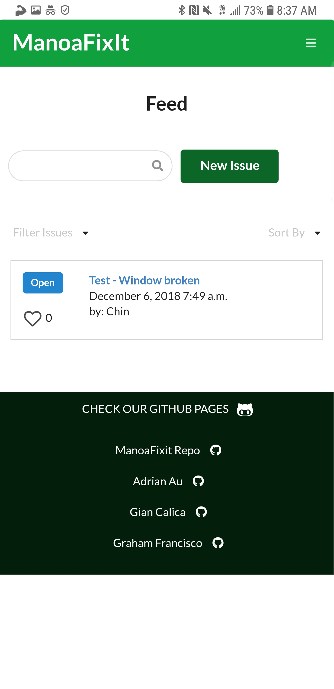

 <i>App Homepage (desktop)</i> 

## Manoa Fix It!

The ManoaFixIt Meteor application, our final project for ICS 311 (Software Engineering I), aims to aid all University of Hawaii at Manoa students to easily report any issues they find around campus such as damaged equipments or facilities without having to go through the trouble of contacting the authorities. With only few mouse clicks and keyboard strokes (or taps on your phone), this app enables users to electronically submit their issues which they can add descriptions and designate tags.

 <i>Submit Form (desktop)</i> 

After submitting an issue, the app adds it on a feed, displaying all other issues reported by other students. In other words, this app increases awareness to every existing problem on campus, thus making it faster to fix or solve them.

 <i>App Feed (desktop)</i> 

Furthermore, the app displays the location of the issues on a map. As you submit an issue, the app gathers the location of the user as the report was made and places a marker on the map so people else could see it for themselves.

 <i>Map Page (desktop)</i> 

What makes this project special is that it lives up to its main objective—to actually make reporting issues REALLY EFFICIENT. In other words, this app would be incomplete if it only works on desktop, both in aesthetics and functionality. As a result, we strived hard to make it function properly as well as appear very pleasing to look at on mobile devices.

 <i>App Feed (mobile)</i> 

## My Contributions

For this project, I mainly worked on the front end side. I tried to make the app look pleasant while maintaining its supposed functionalities and responsiveness. I had to create the home page as beautiful as I could in order to catch the attention of anyone who uses this app. For instance, I worked on the landing page (or home page) and implemented the parallax scrolling to set up a unique atmosphere which indicates that this app is not just some ordinary application; it is something special which will prove useful for people in the future. To make the app even more unique, I created the logo from a [website](https://logojoy.com/) and tweaked it using GIMP, and I also made the custom map markers for the issues. Aside from managing the app's aesthetics, I also implemented the app's responsiveness on mobile phones—I added a sidebar to prevent the page from extending beyond the phone's resolution. Apart from these, I also helped my groupmates from time to time, fixing bugs they assigned me and improving the user interface of any back end function they created.

## What I Learned

This project is the first time I collaborated with someone, albeit I fully knew that someone since we went to the same school. Nevertheless, I learned the importance of teamwork, and to systematically divide tasks between each other. Of course, there were frustrations during the process, but this project made me realize that I will someday collaborate with many people with varying personalities and quirks. This time, though, I am lucky enough to be partnered with someone I knew. This is also an important project for me because we were not given any guidelines, and it was up to us to determine the result of our project using our knowledge that we accumulated during the whole semester. This shows that everytime we learn something, we need to permanently instill them in our minds, and not just treat them as something to be memorized, but rather deeply understood.

Sources:
<a href="https://github.com/manoafixit/manoafixit/tree/master"><i class="large github icon"></i>ManoaFixIt GitHub Repo</a>
<a href="https://github.com/manoafixit/manoafixit/tree/master"><i class="large github icon"></i>ManoaFixIt GitHub Page</a>
