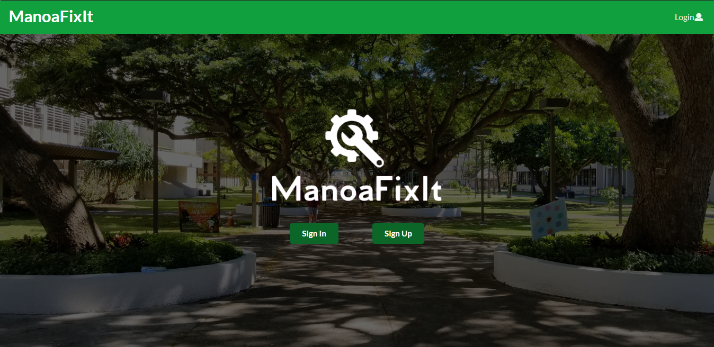

 <i>App Homepage (desktop)</i> 

## Overview

The ManoaFixIt Meteor application, our final project for ICS 311 (Software Engineering I), aims to aid all University of Hawaii at Manoa students to easily report any issues they find around campus such as damaged equipments or facilities without having to go through the trouble of contacting the authorities. With only few mouse clicks and keyboard strokes (or taps on your phone), this app enables users to electronically submit their issues which they can add descriptions and designate tags.

After submitting an issue, the app adds it on a feed, displaying all other issues reported by other students. In other words, this app increases awareness to every existing problem on campus, thus making it faster to fix or solve them.

Furthermore, the app displays the location of the issues on a map. As you submit an issue, the app gathers the location of the user as the report was made and places a marker on the map so people else could see it for themselves.

In this project, we were given the opportunity to choose our own group or partner. We were to create any type of program based on how much we have learned throughout the whole semester. After countless deliberations, my partner and I agreed to create a game based on the popular mobile app Flappy Bird, but this time the character could move freely and there are more obstacles to dodge (in this case, the asteroids). Again, with the help of EZ Graphics, we were able to use pre-implemented functions that would create the movements of the objectj (the main character and the asteroids).

This project is the first time I collaborated with someone, albeit I fully knew that someone since we went to the same school. Nevertheless, I learned the importance of teamwork, and to systematically divide tasks between each other. Of course, there were frustrations during the process, but this project made me realize that I will someday collaborate with many people with varying personalities and quirks. This time, though, I am lucky enough to be partnered with someone I knew. This is also an important project for me because we were not given any guidelines, and it was up to us to determine the result of our project using our knowledge that we accumulated during the whole semester. This shows that everytime we learn something, we need to permanently instill them in our minds, and not just treat them as something to be memorized, but rather deeply understood.

Source: <a href="https://github.com/manoafixit/manoafixit/tree/master"><i class="large github icon"></i>ManoaFixIt</a>
