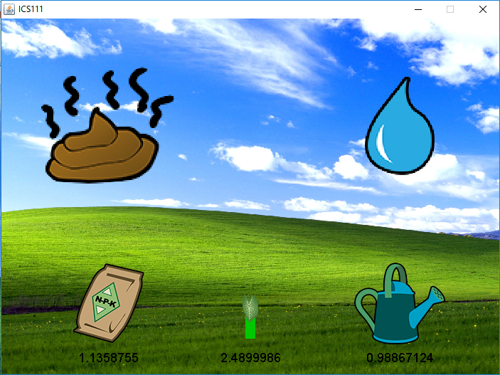

The TaroGotchi is the very first ICS project I have done in ICS 111. It acts as a simulator where there is a plant and two buttons: fertilize and water. Each has its own respective functions; for instance, pressing the fertilize button would increase the plant's health enabling it to survive and leave room for growth while pressing the water button would grow the plant while decreasing the amount of fertilizer it has. The goal of the game is to sufficiently fertilize and water the taro plant until it reaches a certain height. Although, if one over-fertilizes or over-waters the plant, its health would start to decline and once it dies, the game is over.

TaroGotchi is written in Java and with the use of [EZ Graphics](http://www2.hawaii.edu/~dylank/ics111/), a Java class created by Dylan Kobayashi designed to help beginner programmers to display graphics and sounds. Since this is my first program that I have ever written, I learned the complexity of solving problems. There may have been guidelines to help us through the project, but one must conceptualize how each line works. It also reminds me how creative you can be when writing your code; in other words, you can implement a certain function in many different ways. Looking back at it now, I can laugh at my own code due to its sloppy formatting and unecessarily complicated implementations, but I do realize that we all have to start somewhere and it won't be easy.
 
Source: <a href="https://drive.google.com/open?id=1SxpCbil2_ySkbjAaKmNu4gl4v3OQaDkZ"><i class="large github icon"></i>TaroGotchi</a>
