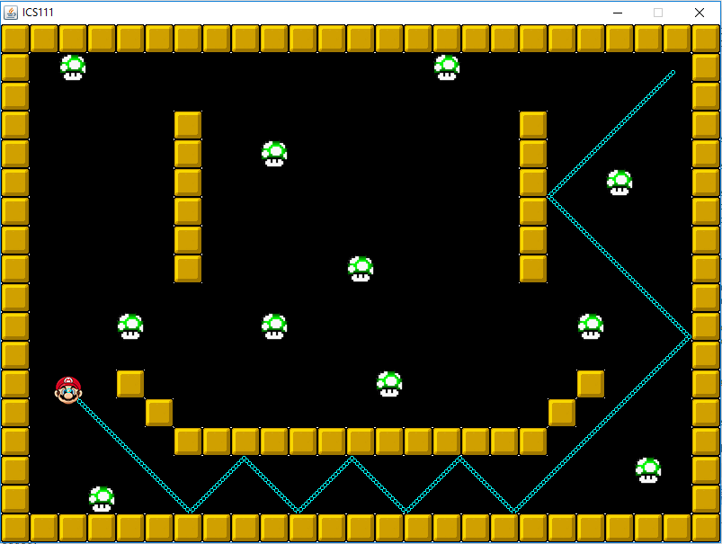

This is my second project in ICS 111. We had to make a roombah (the autonomous robotic vacuum cleaners) simulator. This time, we had learned about 2D arrays and file reading in class. The code primarily reads a text file composed of characters that represent either a block or a mushroom; the program uses 2D arrays to check each character. Then, the roombah will bounce off the blocks and consume the mushrooms, and as it goes through the whole map, it leaves a trail. The game then ends as the roombah collects all mushrooms.

In this project, we the guidelines given to us were significantly more vague than the first project (taro planting simulator), and thus I had a more difficult time implemeting the code. Often, I would get stuck, and when I seemingly make progress, the program then decides to throw countless exceptions. It made me open my mind about the difficulty of this course—I will get stuck at some point when coding, and it will be a challenge to get yourself back on track. Because of this project, I learned patience and perseverance in the midst of struggle and frustration.

Source: <a href="https://drive.google.com/open?id=1ht5Qh5DjJSdU3I6KSEye3UuzoBhOoJZj"><i class="large github icon"></i>Roombrah</a>

